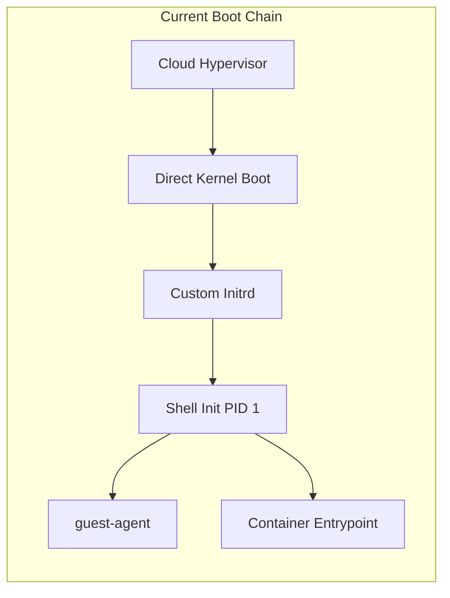
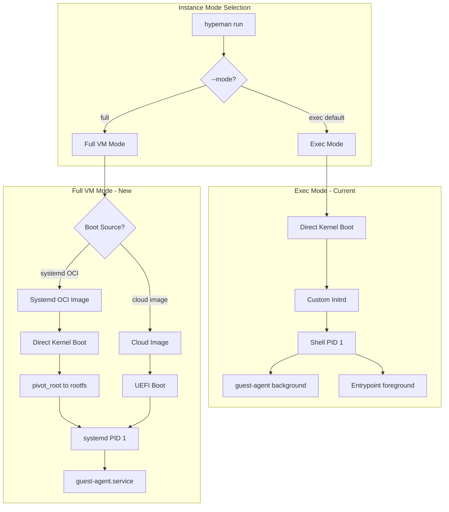

# EC2-Style Full VM Support for Hypeman

## Current Architecture



Your current approach is optimized for container-like workloads:

- **Direct kernel boot** with custom initrd (no bootloader)
- **Shell script as PID 1** that runs entrypoint + guest-agent
- **OCI images as rootfs** via overlay filesystem

## Proposed Architecture: Two VM Modes




## How EC2 Does It

1. **AMI = Bootable EBS Volume**: Contains bootloader (GRUB), kernel, initramfs, full OS with systemd
2. **IMDS (Instance Metadata Service)**: HTTP endpoint at `169.254.169.254` provides instance config, credentials, user-data
3. **cloud-init**: Runs on boot to configure networking, SSH keys, run user-data scripts
4. **SSM Agent / SSH**: Enables remote access post-boot

## Recommended Approach

### Option A: UEFI Boot with Cloud Images (Recommended for ISOs/Cloud Images)

For booting Ubuntu/Debian cloud images or custom ISOs:

1. **Use Cloud Hypervisor's UEFI firmware** (`hypervisor-fw`)
2. **Boot from disk image** (qcow2/raw) containing full OS with systemd
3. **cloud-init for configuration**: Create a cloud-init NoCloud datasource disk with:

- Network configuration
- SSH keys
- Guest-agent installation/startup

4. **Guest-agent as systemd service**: Install and enable via cloud-init
```bash
# Example: Convert cloud image for Cloud Hypervisor
wget https://cloud-images.ubuntu.com/noble/current/noble-server-cloudimg-amd64.img
qemu-img convert -p -f qcow2 -O raw noble-server-cloudimg-amd64.img noble.raw

# Boot with UEFI
cloud-hypervisor \
  --kernel hypervisor-fw \
  --disk path=noble.raw path=cloud-init.img \
  --cpus boot=4 --memory size=2G \
  --net tap=tap0,mac=...
```


### Option B: Direct Kernel Boot with Systemd Handoff (Recommended for Systemd OCI Images)

For OCI images that contain systemd (e.g., `systemd/systemd` base images):

1. **Keep current direct kernel boot** (fast, no bootloader)
2. **Modify init script** to detect `FULL_VM_MODE=1` in config
3. **Use `pivot_root` + `exec /sbin/init`** instead of running entrypoint
4. **Pre-install guest-agent** as systemd service in the image or inject via overlay
```1:294:hypeman/lib/system/init_script.go
// Extend init_script.go with full-vm mode:

# After overlay setup and network config, add:
if [ "${FULL_VM_MODE:-0}" = "1" ]; then
  # Full VM mode: hand off to systemd
  echo "overlay-init: full-vm mode - switching to systemd"
  
  # Install guest-agent as systemd service
  mkdir -p /overlay/newroot/etc/systemd/system
  cat > /overlay/newroot/etc/systemd/system/hypeman-agent.service << 'EOF'
[Unit]
Description=Hypeman Guest Agent
After=network.target

[Service]
ExecStart=/usr/local/bin/guest-agent
Restart=always
RestartSec=5

[Install]
WantedBy=multi-user.target
EOF
  
  ln -sf /etc/systemd/system/hypeman-agent.service \
    /overlay/newroot/etc/systemd/system/multi-user.target.wants/hypeman-agent.service
  
  # pivot_root and exec systemd
  cd /overlay/newroot
  pivot_root . oldroot
  exec /sbin/init
fi
```


### Option C: Hybrid Metadata Service (EC2-Compatible)

For maximum EC2 compatibility:

1. **Implement IMDS-compatible endpoint** in guest-agent at `169.254.169.254`
2. **Serve instance metadata, user-data, credentials** via this endpoint
3. **Works with standard cloud-init** out of the box

## Recommended Implementation Path

| Feature | Complexity | EC2-Feel | Notes ||---------|------------|----------|-------|| Option B (systemd OCI) | Low | Medium | Extends current init script, minimal changes || Option A (UEFI + cloud images) | Medium | High | Requires UEFI firmware, cloud-init disk generation || Option C (IMDS) | Medium | Very High | Makes cloud-init "just work" |

### Suggested Phased Approach

**Phase 1: Systemd OCI Support (Option B)**

- Add `--mode full` flag to `hypeman run`
- Add `FULL_VM_MODE` to config disk generation
- Modify init script to pivot_root + exec systemd
- Inject guest-agent.service into overlay

**Phase 2: Cloud Image Support (Option A)**

- Add `--boot-image` flag for raw/qcow2 images
- Download and bundle UEFI firmware (hypervisor-fw)
- Generate cloud-init NoCloud datasource disks
- Package guest-agent as installable .deb/.rpm

**Phase 3: IMDS Compatibility (Option C)**

- Add HTTP server to guest-agent listening on 169.254.169.254:80
- Implement EC2 IMDS v1/v2 compatible endpoints
- Remove need for custom cloud-init config

## Processing ISOs into Bootable Images

For ISOs, you have two paths:

1. **One-time conversion** (recommended): Install the ISO to a disk image using QEMU/virt-install, then use the resulting disk image as a template
   ```bash
                     # Create empty disk
                     qemu-img create -f raw base.raw 20G
                     
                     # Install from ISO (interactive or via preseed/kickstart)
                     qemu-system-x86_64 -enable-kvm -m 2G \
                       -cdrom ubuntu-22.04.iso \
                       -drive file=base.raw,format=raw \
                       -boot d
                     
                     # After installation, use base.raw as template
   
   ```