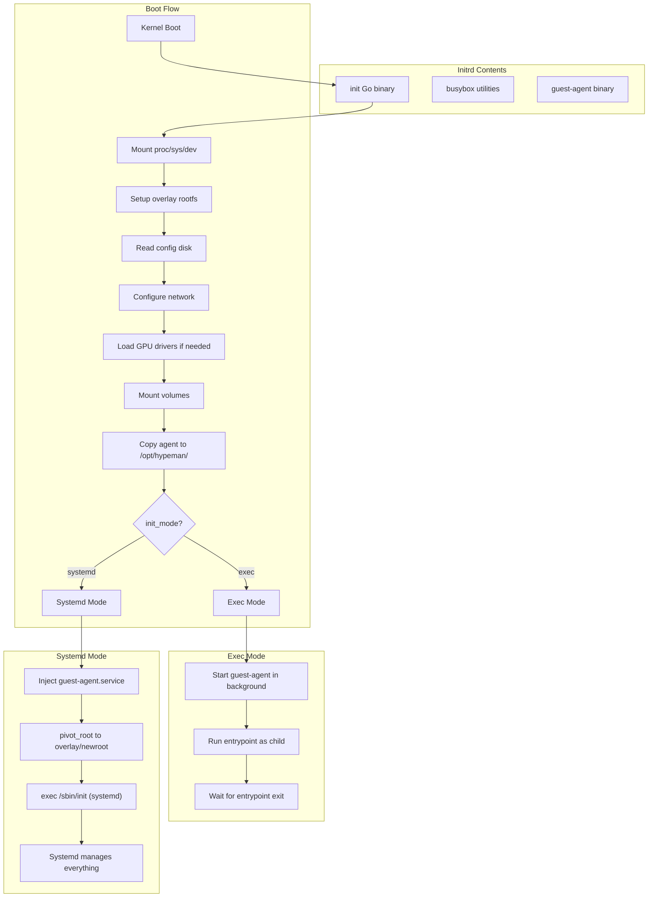

# Systemd VM Support with Go-based Init

## Architecture




## Shared vs Mode-Specific Behavior

| Step | Exec Mode | Systemd Mode |

|------|-----------|--------------|

| Mount proc/sys/dev | Shared | Shared |

| Mount rootfs overlay | Shared | Shared |

| Read config disk | Shared | Shared |

| Configure network | Init configures it | Init configures it (before pivot) |

| Load GPU drivers | Shared | Shared |

| Mount volumes | Shared | Shared |

| Copy guest-agent | To `/opt/hypeman/` | To `/opt/hypeman/` |

| Start guest-agent | Background process | Systemd service |

| PID 1 | Go init binary | Systemd |

| App lifecycle | Managed by init | Managed by systemd |

## Go-based Init Binary

Package structure at `lib/system/init/`:

```javascript
lib/system/init/
    main.go           # Entry point, orchestrates boot
    mount.go          # Mount operations (proc, sys, dev, overlay)
    config.go         # Parse config disk
    network.go        # Network configuration
    drivers.go        # GPU driver loading
    volumes.go        # Volume mounting
    mode_exec.go      # Exec mode: run entrypoint
    mode_systemd.go   # Systemd mode: pivot_root + exec init
    logger.go         # Structured logging to hypeman operations log
```


### Logger Design

Logs to the hypeman operations log (same format as existing hypeman logs):

```go
// lib/system/init/logger.go
package main

type Logger struct {
    file *os.File  // Writes to /logs/hypeman.log via config disk path
}

type LogEntry struct {
    Time    string `json:"time"`
    Level   string `json:"level"`
    Phase   string `json:"phase"`
    Message string `json:"msg"`
    Error   string `json:"error,omitempty"`
}

func (l *Logger) Info(phase, msg string) {
    l.log("INFO", phase, msg, "")
}

func (l *Logger) Error(phase, msg string, err error) {
    errStr := ""
    if err != nil {
        errStr = err.Error()
    }
    l.log("ERROR", phase, msg, errStr)
}

// Output: structured JSON to hypeman operations log
// {"time":"2024-12-23T10:15:30Z","level":"INFO","phase":"overlay","msg":"mounted rootfs"}
```


### Main Orchestration

```go
// lib/system/init/main.go
package main

func main() {
    log := NewLogger()
    log.Info("boot", "init starting")
    
    if err := mountEssentials(log); err != nil {
        log.Error("mount", "failed", err)
        dropToShell()
    }
    
    if err := setupOverlay(log); err != nil {
        log.Error("overlay", "failed", err)
        dropToShell()
    }
    
    cfg, err := readConfig(log)
    if err != nil {
        log.Error("config", "failed", err)
        dropToShell()
    }
    
    if cfg.NetworkEnabled {
        if err := configureNetwork(log, cfg); err != nil {
            log.Error("network", "failed", err)
        }
    }
    
    if cfg.HasGPU {
        if err := loadGPUDrivers(log); err != nil {
            log.Error("gpu", "failed", err)
        }
    }
    
    if err := mountVolumes(log, cfg); err != nil {
        log.Error("volumes", "failed", err)
    }
    
    if err := copyGuestAgent(log); err != nil {
        log.Error("agent", "failed to copy", err)
    }
    
    if cfg.InitMode == "systemd" {
        log.Info("mode", "entering systemd mode")
        runSystemdMode(log, cfg)
    } else {
        log.Info("mode", "entering exec mode")
        runExecMode(log, cfg)
    }
}
```


### Systemd Mode

```go
// lib/system/init/mode_systemd.go
package main

import (
    "os"
    "syscall"
)

func runSystemdMode(log *Logger, cfg *Config) {
    const newroot = "/overlay/newroot"
    
    log.Info("systemd", "injecting hypeman-agent.service")
    if err := injectAgentService(newroot); err != nil {
        log.Error("systemd", "failed to inject service", err)
    }
    
    oldroot := newroot + "/oldroot"
    os.MkdirAll(oldroot, 0755)
    
    if err := os.Chdir(newroot); err != nil {
        log.Error("systemd", "chdir failed", err)
        dropToShell()
    }
    
    log.Info("systemd", "executing pivot_root")
    if err := syscall.PivotRoot(".", "oldroot"); err != nil {
        log.Error("systemd", "pivot_root failed", err)
        dropToShell()
    }
    
    os.Chdir("/")
    
    log.Info("systemd", "exec /sbin/init")
    syscall.Exec("/sbin/init", []string{"/sbin/init"}, os.Environ())
    
    log.Error("systemd", "exec failed", nil)
    dropToShell()
}

func injectAgentService(newroot string) error {
    serviceContent := `[Unit]
Description=Hypeman Guest Agent
After=network.target

[Service]
Type=simple
ExecStart=/opt/hypeman/guest-agent
Restart=always
RestartSec=3

[Install]
WantedBy=multi-user.target
`
    serviceDir := newroot + "/etc/systemd/system"
    wantsDir := serviceDir + "/multi-user.target.wants"
    os.MkdirAll(wantsDir, 0755)
    
    servicePath := serviceDir + "/hypeman-agent.service"
    if err := os.WriteFile(servicePath, []byte(serviceContent), 0644); err != nil {
        return err
    }
    return os.Symlink(servicePath, wantsDir+"/hypeman-agent.service")
}
```


## Detection Logic

```go
// lib/images/systemd.go
package images

import "strings"

func IsSystemdImage(entrypoint, cmd []string) bool {
    effective := append(entrypoint, cmd...)
    if len(effective) == 0 {
        return false
    }
    
    first := effective[0]
    systemdPaths := []string{
        "/sbin/init",
        "/lib/systemd/systemd",
        "/usr/lib/systemd/systemd",
    }
    for _, p := range systemdPaths {
        if first == p {
            return true
        }
    }
    if strings.HasSuffix(first, "/init") {
        return true
    }
    return false
}
```


## CLI and API

```bash
# Auto-detect from image CMD (default)
hypeman run my-systemd-image

# Force systemd mode
hypeman run --init-mode=systemd my-image

# Force exec mode on a systemd image
hypeman run --init-mode=exec my-systemd-image
```


## E2E Test

Custom Dockerfile in repository at `integration/testdata/systemd/Dockerfile`:

```dockerfile
FROM ubuntu:22.04

ENV DEBIAN_FRONTEND=noninteractive

RUN apt-get update && apt-get install -y \
    systemd \
    systemd-sysv \
    dbus \
    && apt-get clean \
    && rm -rf /var/lib/apt/lists/*

# Remove unnecessary systemd units
RUN rm -f /lib/systemd/system/multi-user.target.wants/* \
    /etc/systemd/system/*.wants/* \
    /lib/systemd/system/local-fs.target.wants/* \
    /lib/systemd/system/sockets.target.wants/*udev* \
    /lib/systemd/system/sockets.target.wants/*initctl*

VOLUME ["/sys/fs/cgroup"]
CMD ["/lib/systemd/systemd"]
```

Test flow:

1. Build image with `docker build`
2. Push to hypeman via OCI import
3. Run instance (should auto-detect systemd mode)
4. Verify systemd is PID 1
5. Verify guest-agent.service is active
```go
// integration/systemd_test.go

func TestSystemdMode(t *testing.T) {
    // Build and push test image
    buildAndPushTestImage(t, "integration/testdata/systemd", "test-systemd:latest")
    
    // Create instance (auto-detects systemd mode)
    inst := createInstance(t, "test-systemd:latest", "")
    defer deleteInstance(t, inst.Id)
    
    time.Sleep(10 * time.Second)
    
    // Verify systemd is PID 1
    result := execInVM(t, inst, "cat", "/proc/1/comm")
    assert.Equal(t, "systemd", strings.TrimSpace(result.Stdout))
    
    // Verify agent service is running
    result = execInVM(t, inst, "systemctl", "is-active", "hypeman-agent")
    assert.Equal(t, "active", strings.TrimSpace(result.Stdout))
    
    // Verify agent location
    result = execInVM(t, inst, "test", "-x", "/opt/hypeman/guest-agent")
    assert.Equal(t, 0, result.ExitCode)
}

func TestInitModeOverride(t *testing.T) {
    buildAndPushTestImage(t, "integration/testdata/systemd", "test-systemd:latest")
    
    // Force exec mode
    inst := createInstance(t, "test-systemd:latest", "exec")
    defer deleteInstance(t, inst.Id)
    
    time.Sleep(5 * time.Second)
    
    // PID 1 should be our init, not systemd
    result := execInVM(t, inst, "cat", "/proc/1/comm")
    assert.NotEqual(t, "systemd", strings.TrimSpace(result.Stdout))
}
```