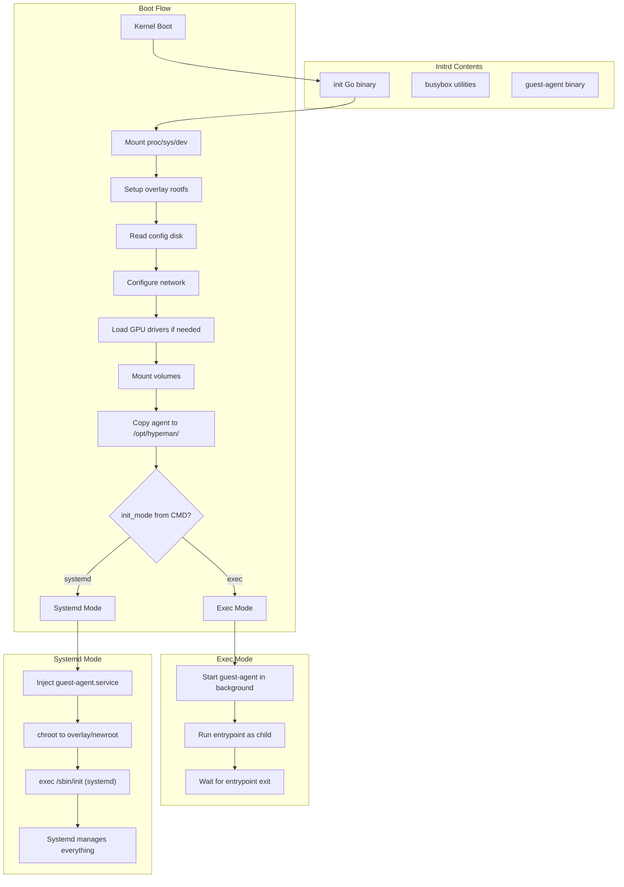

# Systemd VM Support with Go-based Init

## Architecture



## Shared vs Mode-Specific Behavior

| Step | Exec Mode | Systemd Mode ||------|-----------|--------------|| Mount proc/sys/dev | Shared | Shared || Mount rootfs overlay | Shared | Shared || Read config disk | Shared | Shared || Configure network | Init configures it | Init configures it (before pivot) || Load GPU drivers | Shared | Shared || Mount volumes | Shared | Shared || Copy guest-agent | To `/opt/hypeman/` | To `/opt/hypeman/` || Start guest-agent | Background process | Systemd service || PID 1 | Go init binary | Systemd || App lifecycle | Managed by init | Managed by systemd |

## Logging Behavior

### `hypeman logs` Output by Mode

| Log Source | Exec Mode | Systemd Mode ||------------|-----------|--------------|| `--source app` (default) | Entrypoint stdout/stderr | Systemd boot messages + console output || `--source hypeman` | Init phases + operations | Init phases + operations (until pivot_root) || `--source vmm` | Cloud Hypervisor logs | Cloud Hypervisor logs |In systemd mode, after pivot_root:

- Serial console (app.log) shows systemd boot progress and any services writing to console
- To view individual service logs, use: `hypeman exec <vm> journalctl -u <service>`
- To view guest-agent logs: `hypeman exec <vm> journalctl -u hypeman-agent`

### Init Logger Format

Human-readable format for `hypeman logs --source hypeman`:

```go
// lib/system/init/logger.go
package main

type Logger struct {
    file *os.File
}

func (l *Logger) Info(phase, msg string) {
    // Format: 2024-12-23T10:15:30Z [INFO] [overlay] mounted rootfs from /dev/vda
    fmt.Fprintf(l.file, "%s [INFO] [%s] %s\n", 
        time.Now().UTC().Format(time.RFC3339), phase, msg)
}

func (l *Logger) Error(phase, msg string, err error) {
    if err != nil {
        fmt.Fprintf(l.file, "%s [ERROR] [%s] %s: %v\n",
            time.Now().UTC().Format(time.RFC3339), phase, msg, err)
    } else {
        fmt.Fprintf(l.file, "%s [ERROR] [%s] %s\n",
            time.Now().UTC().Format(time.RFC3339), phase, msg)
    }
}

// Example output:
// 2024-12-23T10:15:30Z [INFO] [boot] init starting
// 2024-12-23T10:15:30Z [INFO] [mount] mounted proc/sys/dev
// 2024-12-23T10:15:31Z [INFO] [overlay] mounted rootfs from /dev/vda
// 2024-12-23T10:15:31Z [INFO] [network] configured eth0 with 10.0.0.2/24
// 2024-12-23T10:15:32Z [INFO] [systemd] performing pivot_root
// 2024-12-23T10:15:32Z [INFO] [systemd] exec /sbin/init
```

## Go-based Init Binary

Package structure at `lib/system/init/`:

```javascript
lib/system/init/
    main.go           # Entry point, orchestrates boot
    mount.go          # Mount operations (proc, sys, dev, overlay)
    config.go         # Parse config disk
    network.go        # Network configuration
    drivers.go        # GPU driver loading
    volumes.go        # Volume mounting
    mode_exec.go      # Exec mode: run entrypoint
    mode_systemd.go   # Systemd mode: pivot_root + exec init
    logger.go         # Human-readable logging to hypeman operations log
```

### Main Orchestration

```go
// lib/system/init/main.go
package main

func main() {
    log := NewLogger()
    log.Info("boot", "init starting")
    
    if err := mountEssentials(log); err != nil {
        log.Error("mount", "failed", err)
        dropToShell()
    }
    
    if err := setupOverlay(log); err != nil {
        log.Error("overlay", "failed", err)
        dropToShell()
    }
    
    cfg, err := readConfig(log)
    if err != nil {
        log.Error("config", "failed", err)
        dropToShell()
    }
    
    if cfg.NetworkEnabled {
        if err := configureNetwork(log, cfg); err != nil {
            log.Error("network", "failed", err)
        }
    }
    
    if cfg.HasGPU {
        if err := loadGPUDrivers(log); err != nil {
            log.Error("gpu", "failed", err)
        }
    }
    
    if err := mountVolumes(log, cfg); err != nil {
        log.Error("volumes", "failed", err)
    }
    
    if err := copyGuestAgent(log); err != nil {
        log.Error("agent", "failed to copy", err)
    }
    
    if cfg.InitMode == "systemd" {
        log.Info("mode", "entering systemd mode")
        runSystemdMode(log, cfg)
    } else {
        log.Info("mode", "entering exec mode")
        runExecMode(log, cfg)
    }
}
```

### Systemd Mode

```go
// lib/system/init/mode_systemd.go
package main

import (
    "os"
    "syscall"
)

func runSystemdMode(log *Logger, cfg *Config) {
    const newroot = "/overlay/newroot"
    
    log.Info("systemd", "injecting hypeman-agent.service")
    if err := injectAgentService(newroot); err != nil {
        log.Error("systemd", "failed to inject service", err)
    }
    
    // Use chroot instead of pivot_root (more reliable in VM environment)
    log.Info("systemd", "executing chroot")
    if err := syscall.Chroot(newroot); err != nil {
        log.Error("systemd", "chroot failed", err)
        dropToShell()
    }
    
    os.Chdir("/")
    
    log.Info("systemd", "exec /sbin/init")
    syscall.Exec("/sbin/init", []string{"/sbin/init"}, os.Environ())
    
    log.Error("systemd", "exec failed", nil)
    dropToShell()
}

func injectAgentService(newroot string) error {
    serviceContent := `[Unit]
Description=Hypeman Guest Agent
After=network.target

[Service]
Type=simple
ExecStart=/opt/hypeman/guest-agent
Restart=always
RestartSec=3

[Install]
WantedBy=multi-user.target
`
    serviceDir := newroot + "/etc/systemd/system"
    wantsDir := serviceDir + "/multi-user.target.wants"
    os.MkdirAll(wantsDir, 0755)
    
    servicePath := serviceDir + "/hypeman-agent.service"
    if err := os.WriteFile(servicePath, []byte(serviceContent), 0644); err != nil {
        return err
    }
    return os.Symlink(servicePath, wantsDir+"/hypeman-agent.service")
}
```

## Detection Logic

Auto-detect systemd mode by inspecting the image's CMD. No override flag - if CMD is a systemd init, always use systemd mode.

```go
// lib/images/systemd.go
package images

import "strings"

// IsSystemdImage checks if the image's CMD indicates it wants systemd as init.
// Detection is based on the effective command (entrypoint + cmd), not whether
// systemd is installed in the image.
func IsSystemdImage(entrypoint, cmd []string) bool {
    // Combine to get the actual command that will run
    effective := append(entrypoint, cmd...)
    if len(effective) == 0 {
        return false
    }
    
    first := effective[0]
    
    // Match specific systemd/init paths
    systemdPaths := []string{
        "/sbin/init",
        "/lib/systemd/systemd",
        "/usr/lib/systemd/systemd",
    }
    for _, p := range systemdPaths {
        if first == p {
            return true
        }
    }
    
    // Match any path ending in /init (e.g., /usr/sbin/init)
    if strings.HasSuffix(first, "/init") {
        return true
    }
    
    return false
}
```

## E2E Test

Custom Dockerfile in repository at `integration/testdata/systemd/Dockerfile`:

```dockerfile
FROM ubuntu:22.04

ENV DEBIAN_FRONTEND=noninteractive

RUN apt-get update && apt-get install -y \
    systemd \
    systemd-sysv \
    dbus \
    && apt-get clean \
    && rm -rf /var/lib/apt/lists/*

# Remove unnecessary systemd units
RUN rm -f /lib/systemd/system/multi-user.target.wants/* \
    /etc/systemd/system/*.wants/* \
    /lib/systemd/system/local-fs.target.wants/* \
    /lib/systemd/system/sockets.target.wants/*udev* \
    /lib/systemd/system/sockets.target.wants/*initctl*

VOLUME ["/sys/fs/cgroup"]
CMD ["/lib/systemd/systemd"]
```

Test flow:

1. Build image with `docker build`
2. Push to hypeman via OCI import
3. Run instance (auto-detects systemd mode from CMD)
4. Verify systemd is PID 1
5. Verify guest-agent.service is active
6. Verify `hypeman logs` shows systemd boot messages
```go
// integration/systemd_test.go

func TestSystemdMode(t *testing.T) {
    // Build and push test image
    buildAndPushTestImage(t, "integration/testdata/systemd", "test-systemd:latest")
    
    // Create instance (auto-detects systemd mode from CMD)
    inst := createInstance(t, "test-systemd:latest")
    defer deleteInstance(t, inst.Id)
    
    time.Sleep(10 * time.Second)
    
    // Verify systemd is PID 1
    result := execInVM(t, inst, "cat", "/proc/1/comm")
    assert.Equal(t, "systemd", strings.TrimSpace(result.Stdout))
    
    // Verify agent service is running
    result = execInVM(t, inst, "systemctl", "is-active", "hypeman-agent")
    assert.Equal(t, "active", strings.TrimSpace(result.Stdout))
    
    // Verify agent location
    result = execInVM(t, inst, "test", "-x", "/opt/hypeman/guest-agent")
    assert.Equal(t, 0, result.ExitCode)
    
    // Verify can view agent logs via journalctl
    result = execInVM(t, inst, "journalctl", "-u", "hypeman-agent", "--no-pager")
    assert.Equal(t, 0, result.ExitCode)
}

func TestExecModeUnchanged(t *testing.T) {
    // Regular container image should still work as before
    inst := createInstance(t, "nginx:alpine")
    defer deleteInstance(t, inst.Id)
    
    time.Sleep(3 * time.Second)
    
    // Nginx should be running
    result := execInVM(t, inst, "pgrep", "nginx")
    assert.Equal(t, 0, result.ExitCode)
    
    // PID 1 is init binary (not systemd)
    result = execInVM(t, inst, "cat", "/proc/1/comm")
    assert.Equal(t, "init", strings.TrimSpace(result.Stdout))
}
```


## Files to Modify/Create