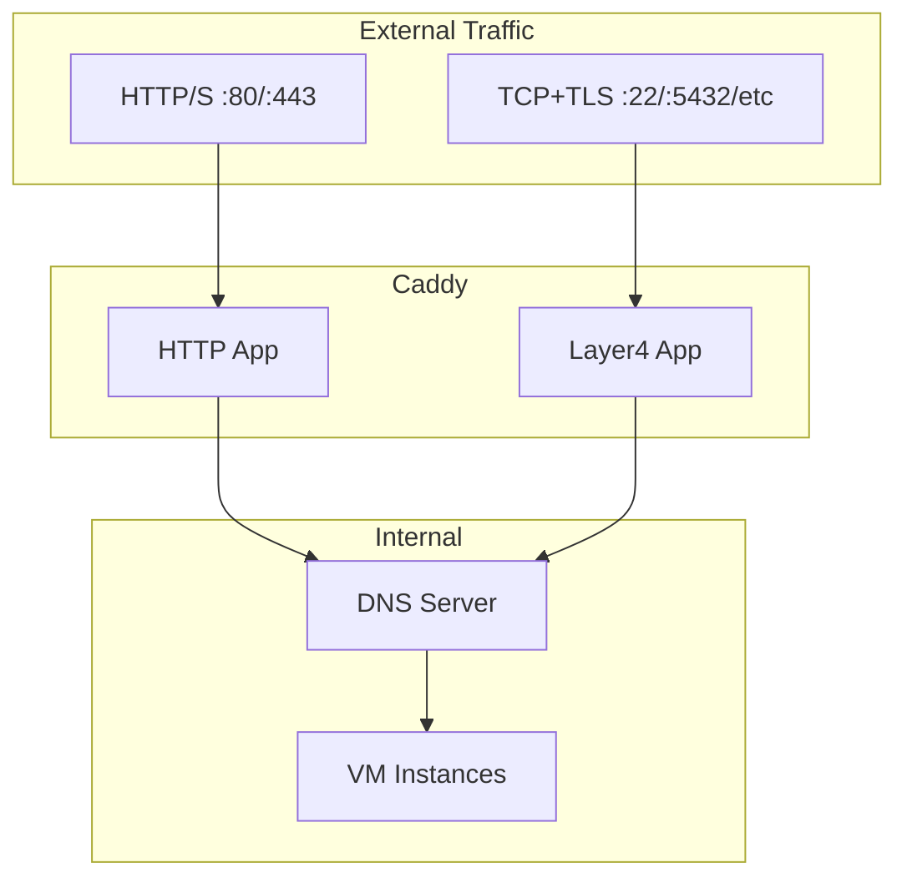

# TCP Ingress Implementation Plan

## Summary

Add TCP ingress support using Caddy L4 module. TCP ingresses require TLS (for SNI-based routing), run on separate ports from HTTP ingresses, and use the same pattern routing (`{instance}.example.com`) as HTTP ingresses.

## Architecture



**Key constraint:** A port can be owned by either HTTP ingress OR TCP ingress, not both. Reserved ports (hypeman API, host SSH) are blocked from both.

## Implementation

### Phase 1: Caddy L4 Module

Add `caddy-l4` to the custom Caddy build in [`Makefile`](hypeman/Makefile):

```makefile
CADDY_DNS_MODULES := --with github.com/caddy-dns/cloudflare
CADDY_L4_MODULES := --with github.com/mholt/caddy-l4
```

Rebuild Caddy binaries and update embedded binary hash.

### Phase 2: Types and Storage

Create [`lib/ingress/tcp_types.go`](hypeman/lib/ingress/tcp_types.go) with:

```go
type TCPIngress struct {
    ID         string           `json:"id"`
    Name       string           `json:"name"`
    ListenPort int              `json:"listen_port"`
    Rules      []TCPIngressRule `json:"rules"`
    CreatedAt  time.Time        `json:"created_at"`
}

type TCPIngressRule struct {
    Match  TCPIngressMatch  `json:"match"`
    Target TCPIngressTarget `json:"target"`
}

type TCPIngressMatch struct {
    SNI string `json:"sni"`  // e.g., "{instance}.example.com" or "mydb.example.com"
}

type TCPIngressTarget struct {
    Instance string `json:"instance"`  // e.g., "{instance}" or "my-postgres-vm"
    Port     int    `json:"port"`      // e.g., 22, 5432
}
```

Storage in [`lib/ingress/tcp_storage.go`](hypeman/lib/ingress/tcp_storage.go):

- Path: `{dataDir}/tcp-ingresses/{id}.json`
- Same pattern as HTTP ingress storage

### Phase 3: Config Generator

Extend [`lib/ingress/config.go`](hypeman/lib/ingress/config.go):

1. Add `buildL4Config(tcpIngresses []TCPIngress)` method
2. Modify `GenerateConfig()` to include both `http` and `layer4` apps
3. For pattern SNI matching, use `sni_regexp` with captures:

- Pattern `{instance}.example.com` becomes regex `^(.+)\.example\.com$`
- Dial uses `{tls.regexp.1}.hypeman.internal:port`

Example L4 config output:

```json
{
  "apps": {
    "layer4": {
      "servers": {
        "tcp-22": {
          "listen": ["0.0.0.0:22"],
          "routes": [{
            "match": [{"tls": {"sni_regexp": {"pattern": "^(.+)\\.example\\.com$"}}}],
            "handle": [
              {"handler": "tls"},
              {"handler": "proxy", "upstreams": [{"dial": ["{tls.regexp.1}.hypeman.internal:22"]}]}
            ]
          }]
        }
      }
    }
  }
}
```


### Phase 4: Manager Extension

Extend [`lib/ingress/manager.go`](hypeman/lib/ingress/manager.go) or create new `tcp_manager.go`:

1. Add `TCPManager` interface with `Create`, `Get`, `List`, `Delete`
2. Port conflict validation:

- Check against existing HTTP ingress ports
- Check against existing TCP ingress ports
- Check against reserved ports (configurable list)

3. Pattern validation (reuse `ParsePattern` from HTTP ingress)
4. Instance validation for literal targets

### Phase 5: API Endpoints

Add to [`openapi.yaml`](hypeman/openapi.yaml):

- `GET /tcp-ingresses` - List all TCP ingresses
- `POST /tcp-ingresses` - Create TCP ingress
- `GET /tcp-ingresses/{id}` - Get TCP ingress by ID/name
- `DELETE /tcp-ingresses/{id}` - Delete TCP ingress

Create [`cmd/api/api/tcp_ingress.go`](hypeman/cmd/api/api/tcp_ingress.go) with handlers.

### Phase 6: Reserved Ports

Add configuration for reserved ports in [`cmd/api/config/config.go`](hypeman/cmd/api/config/config.go):

```go
// RESERVED_PORTS environment variable (comma-separated)
// Default: "2019,2222" (Caddy admin, host SSH)
ReservedPorts []int
```

Validate in both HTTP and TCP ingress creation.

## Files to Create/Modify

| File | Action | Description ||------|--------|-------------|| `Makefile` | Modify | Add caddy-l4 to build || `lib/ingress/binaries*.go` | Modify | Update embedded binary refs after rebuild || `lib/ingress/tcp_types.go` | Create | TCP ingress types and validation || `lib/ingress/tcp_storage.go` | Create | TCP ingress persistence || `lib/ingress/tcp_config.go` | Create | L4 config generation || `lib/ingress/manager.go` | Modify | Add TCP ingress management || `lib/ingress/ports.go` | Create | Port conflict and reservation logic || `openapi.yaml` | Modify | Add TCP ingress schemas and endpoints || `lib/oapi/oapi.go` | Regenerate | After openapi.yaml changes || `cmd/api/api/tcp_ingress.go` | Create | API handlers || `cmd/api/api/api.go` | Modify | Wire up TCP ingress manager || `cmd/api/config/config.go` | Modify | Add RESERVED_PORTS config |

## Testing Strategy

1. Unit tests for pattern parsing (`{instance}.example.com` → regex)