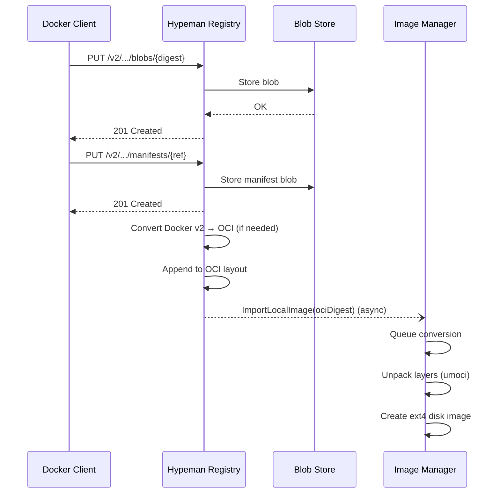

# OCI Distribution Registry

Implements an OCI Distribution Spec compliant registry that accepts pushed images and triggers conversion to hypeman's disk format.

## Architecture



## How It Works

### Push Flow

1. **Version Check**: Client hits `GET /v2/` to verify registry compatibility
2. **Blob Check**: Client does `HEAD /v2/{name}/blobs/{digest}` to check if layers exist
3. **Blob Upload**: Missing blobs uploaded via `POST/PATCH/PUT` sequence
4. **Manifest Upload**: Final `PUT /v2/{name}/manifests/{reference}` triggers conversion

### Layer Caching

Blobs are stored content-addressably in `system/oci-cache/blobs/sha256/`:

```go
// BlobStore.Stat() - Returns size if exists, ErrNotFound otherwise
func (s *BlobStore) Stat(ctx context.Context, repo string, h v1.Hash) (int64, error) {
    path := s.blobPath(h.String())
    info, err := os.Stat(path)
    if os.IsNotExist(err) {
        return 0, ErrNotFound  // Client will upload
    }
    return info.Size(), nil    // Client skips upload
}
```

When a client pushes:
- First push: HEAD returns 404 → uploads all blobs
- Second push: HEAD returns 200 with size → skips upload entirely

### Manifest Handling

go-containerregistry stores manifests in-memory, but we need them on disk for conversion. The registry intercepts manifest PUTs:

```go
// Read manifest body and compute digest
body, _ := io.ReadAll(req.Body)
digest := computeDigest(body)

// Store in blob store by digest
r.storeManifestBlob(digest, body)

// Reconstruct body for underlying handler
req.Body = io.NopCloser(bytes.NewReader(body))
r.handler.ServeHTTP(wrapper, req)

// Trigger async conversion with computed digest
if wrapper.statusCode == http.StatusCreated {
    go r.triggerConversion(repo, reference, digest)
}
```

### Conversion Trigger

After a successful manifest push:

1. Creates a `blobStoreImage` wrapper that reads from the blob store
2. If manifest is Docker v2 format, converts it to OCI format (different digest)
3. Appends to OCI layout via `layout.AppendImage()` which updates `index.json`
4. Calls `ImageManager.ImportLocalImage()` with the OCI digest to queue conversion

### Docker v2 to OCI Conversion

Images from the local Docker daemon use Docker v2 manifest format, but umoci (used for unpacking layers) only accepts OCI format. The registry handles this transparently:

```go
// blobStoreImage detects Docker v2 and converts media types
func (img *blobStoreImage) MediaType() (types.MediaType, error) {
    if isOCIMediaType(manifest.MediaType) {
        return types.MediaType(manifest.MediaType), nil
    }
    return types.OCIManifestSchema1, nil  // Convert Docker v2 → OCI
}

// Digest returns OCI digest (differs from Docker v2 input digest)
func (img *blobStoreImage) Digest() (v1.Hash, error) {
    if isOCIMediaType(manifest.MediaType) {
        return v1.NewHash(img.digest)  // Preserve original
    }
    // Compute digest of converted OCI manifest
    rawManifest, _ := img.RawManifest()
    return sha256Hash(rawManifest)
}
```

Media type conversions:
- `vnd.docker.distribution.manifest.v2+json` → `vnd.oci.image.manifest.v1+json`
- `vnd.docker.container.image.v1+json` → `vnd.oci.image.config.v1+json`
- `vnd.docker.image.rootfs.diff.tar.gzip` → `vnd.oci.image.layer.v1.tar+gzip`

## Files

- **`blob_store.go`** - Filesystem-backed blob storage implementing `registry.BlobHandler`
- **`registry.go`** - Registry handler wrapping go-containerregistry with manifest interception and Docker v2 → OCI conversion (`blobStoreImage`, `blobStoreLayer`)

## Storage Layout

```
/var/lib/hypeman/system/oci-cache/
  oci-layout           # {"imageLayoutVersion": "1.0.0"}
  index.json           # Manifest index with annotations
  blobs/sha256/
    2d35eb...          # Layer blob (shared across all images)
    706db5...          # Config blob
    85f2b7...          # Manifest blob
```

## CLI Usage

```bash
# Push from local Docker daemon
hypeman push myimage:latest

# Push with custom target name
hypeman push myimage:latest my-custom-name
```

## Authentication

The registry endpoints use JWT bearer token authentication. The hypeman CLI reads `HYPEMAN_API_KEY` or `HYPEMAN_BEARER_TOKEN` and passes it directly as a registry token using go-containerregistry's `RegistryToken` auth.

**Note:** `docker push` will not work with this registry. Docker CLI expects the v2 registry token auth flow (WWW-Authenticate challenge → token endpoint → retry with JWT), which we don't implement. Use the hypeman CLI for pushing images.

## Limitations

- **No docker push support**: Docker CLI requires the v2 registry token auth flow. Use `hypeman push` instead.

## Design Decisions

### Why wrap go-containerregistry/pkg/registry?

**What:** Use the existing registry implementation from go-containerregistry with custom blob storage.

**Why:**
- Battle-tested OCI Distribution Spec compliance
- Handles chunked uploads, content negotiation, error responses
- We only need to customize storage, not protocol handling

### Why store manifests separately?

**What:** Intercept manifest PUT and store in blob store.

**Why:**
- go-containerregistry stores manifests in-memory by default
- Our image manager needs to read manifests from disk
- Enables content-addressable manifest storage consistent with layers

### Why convert Docker v2 manifests to OCI?

**What:** Detect Docker v2 manifests and convert to OCI format before passing to umoci.

**Why:**
- `daemon.Image()` (local Docker) returns Docker v2 manifests
- umoci only accepts OCI format (`v1.Manifest`) - Docker v2 causes "manifest data is not v1.Manifest" errors
- go-containerregistry does NOT automatically convert formats
- The converted OCI manifest has a different digest than the input Docker v2 manifest

**Implementation:** The `blobStoreImage` wrapper transparently converts Docker v2 to OCI when the manifest is read, and computes the correct OCI digest for registration.
